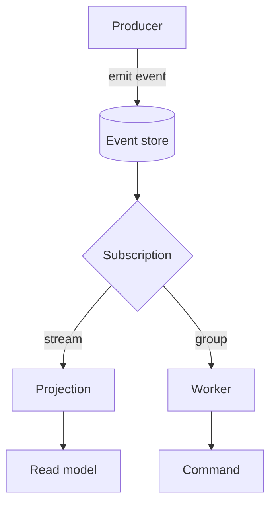
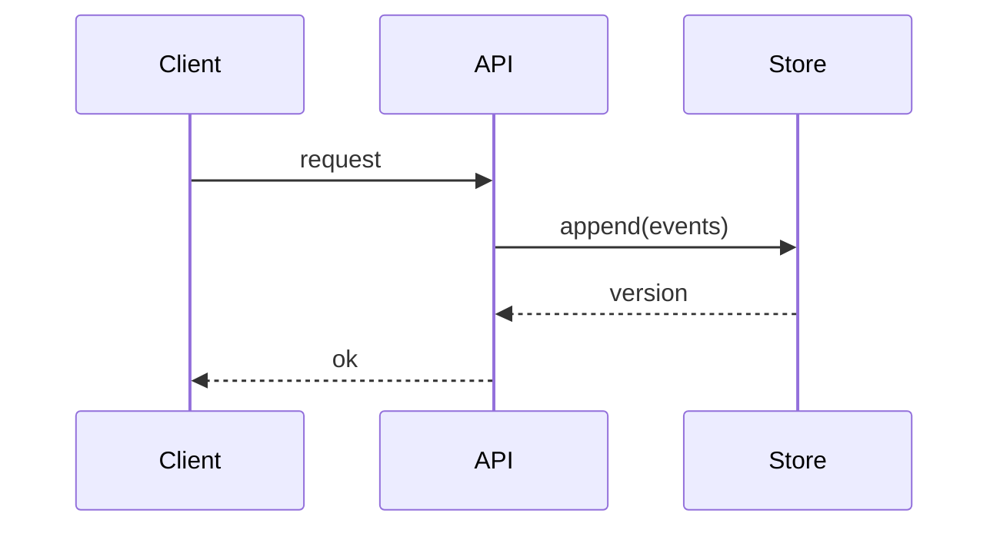

Every ` ```mermaid ` fenced block renders with the interactive `<Mermaid>`
component: wheel to zoom toward the cursor, drag to pan, double-click to fit, and
**Expand** for a full-screen view. Keyboard: `+` / `-` zoom, `0` fits, `Esc`
closes the overlay.

A flowchart:



A sequence diagram, to confirm non-flowchart diagrams render too:


